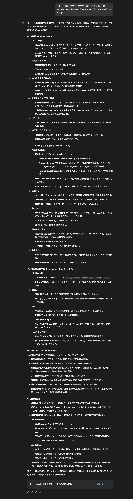

+++
date = '2025-06-14T16:41:52+08:00'
draft = false
categories = ['项目']
title = '暑假个人趣味项目规划'
+++
# 暑假项目该如何安排？
暑假时光来临之时，我才发现这段闲暇的时光如此美好，以至于有太多想做的事情。为了更好地利用时间，我认为需要一些基本的规划，以规避*眉毛胡子一把抓*的问题。

# 项目基本规划
## 1. 巩固自己的基础
无论想开发什么项目，亦或是应付课堂，扎实的编程基础和对诸多架构的了解都是不可轻视的基本功。我希望无论是课内的数据结构等课程，还是课外可能学习的html, css，以及ardupilot等知识，都务必巩固好各种语言的语法知识，从根本上了解其原理，而切忌急功近利，急于求成，为了尽快完成作业或者项目而直接抄袭代码（如果有实在不理解之处，抄人家或者ai的代码也是可以的，但是务必尽全力理解其部分原理）

## 2. 我的个人博客
我认为，在更新博客的同时进行一些改进是一个很不错的节奏。一方面，本来搭建博客是由自己的想法在，所谓的“数字栖息地”嘛；另一方面，搭建这个博客也有锻炼自己的技术能力，以及实现一些有趣的效果的目的在，所以技术更新也是不能落下的。话说回来，对于我自己来说，个人项目是自己兴趣和精神追求的产物，切忌强求。因此，整个博客的更新节奏应当根据自己的喜好来，想做了就做一做，不想做就放一放。本身这就是一个兴趣驱使的项目，我们应该让他保留最本真纯粹的趣味性，而不要用某种指标或者计划去驱使，这样就失去了这种纯粹的趣味性。

## 3. Ardupilot
根植于儿时的梦想应该得到实现。令人魂牵梦萦的ardupilot至今没有得到系统的了解学习和实践，不得不说是有些令人遗憾的。我现在还能回想起小学三四年级放学回家，对着老旧的联想电脑观看各类固定翼fpv视频馋的流口水的时光。大胖子，双子星......那些性能卓越的机型我如数家珍，那时候没有同学或者朋友有这方面的shared interests，但我对于航模似乎就是有一种莫名的兴趣，这种兴趣的浓烈程度超过了需要与他人交流才能延续的程度，而达到了可以自持的水平。现在，这个暑假，机会来了，从来没有这样长段的自由时光可以供我自由地学习自己想学习的东西。

而学习ardupilot也需要一些基本的规划，以下是ai给出的建议以供以后的自己参考：

就我看起来，ardupilot绝对是那种我自己特别感兴趣，同时又能锻炼自己技术能力的项目，暑假的时间较短，可能比较难有特别深刻的建树，等到8月底的时候再回头看吧！到时候对自己的规划和学习能力会有一个新的认识。
